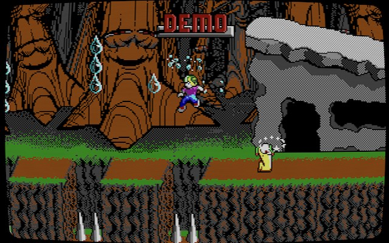
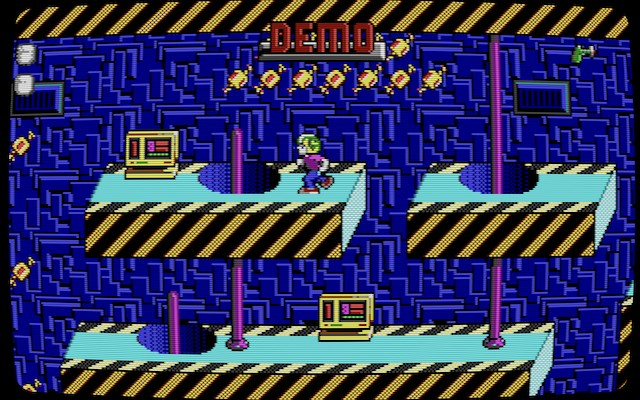
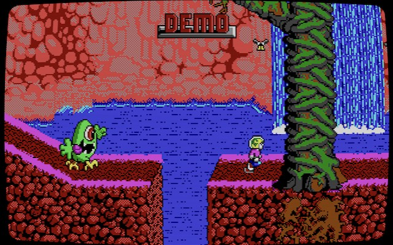

# Commander Keen 4–6 — Browser Port

A native Emscripten/WebAssembly port of K1n9_Duk3's reconstructed source (16-bit DOS / id Engine),
running in the browser.

Supported episodes: CK4 (Secret of the Oracle) / CK5 (The Armageddon Machine) / CK6 (Aliens Ate My Babysitter)

### ▶ Play the EP4 demo in your browser — no download needed

**https://soltune.github.io/keen4-6-web/**

Commander Keen 4 is freely-redistributable Apogee shareware, so the hosted demo runs with no
setup. CK5 and CK6 are not shareware — to play them, clone the repo and supply your own
legally-owned data (see below).

## Screenshots

<p align="center">
  
  
  
</p>
<p align="center"><sub>CK4 · Secret of the Oracle&nbsp;&nbsp;|&nbsp;&nbsp;CK5 · The Armageddon Machine&nbsp;&nbsp;|&nbsp;&nbsp;CK6 · Aliens Ate My Babysitter</sub></p>

> **About the data**: **Commander Keen 4 is freely-redistributable Apogee shareware**, so its
> data is bundled and the [online demo](https://soltune.github.io/keen4-6-web/) is playable with
> no download. **CK5/CK6 are not shareware** — supply data from a copy you legally own (**v1.4**-era
> data is recommended, as it matches the chunk layout the reconstructed engine expects). See
> [`DATA_NOTICE.md`](DATA_NOTICE.md) for details.

---

# Playing the game

## Requirements

- **Node.js 18+** (with `npm`)
- A **modern browser** (current Chrome / Edge / Firefox / Safari — WebAssembly and Web Audio required)
- The **game data** for each episode (files from a copy you legally own)

## Steps

### 1. Clone the repo & place your data

```bash
git clone https://github.com/soltune/keen4-6-web.git
```

**CK4 ships ready to play** — its shareware data is already bundled in the repo, so a fresh
clone runs CK4 with no extra steps. You only need to supply data for **CK5 and CK6**: put each
episode's DOS files into `dos/ck5` and `dos/ck6` (the `dos/ck4` folder can stay empty).

```
dos/ck5/
├── KEEN5E.EXE      ← EGA EXE (used to extract headers/dictionaries; CK6=Keen6.exe)
├── EGAGRAPH.CK5    ← graphics
├── GAMEMAPS.CK5    ← maps
└── AUDIO.CK5       ← audio
```

### 2. Extract the data (CK5 / CK6 only)

```bash
cd keen4-6-web/web && npm install
npm run extract
```

> Skip this step if you only want to play CK4 — its data is already extracted in the repo.

### 3. Run

```bash
npm run dev                          # dev server → http://localhost:5173/
```

Open it in your browser, **select CK4 / CK5 / CK6** (CK5/CK6 stay greyed-out until you've added
their data), then press **Space** at the title screen to start.

### 4. Production build (static files for hosting)

```bash
npm run build                        # outputs to dist/
npm run preview                      # check the build locally
```

Deploy `dist/` to any static host.

---

## Controls

> Due to browser autoplay restrictions, audio is enabled on your **first click / keypress**.

### Keyboard (DOS defaults)

| Action | Key |
|---|---|
| Move | `←` `→` (`↑` `↓` for menus and looking around) |
| Jump | `Ctrl` |
| Pogo stick | `Alt` |
| Fire (stunner) / Start | `Space` |
| Confirm menu | `Enter` |
| Status / score panel | `Enter` |
| Pause | `P` |
| Help screens | `F1` (CK4 / CK5 only) |
| Main menu (control panel) | `F2`–`F7` / `Esc` |
| Boss key (hide to a fake `C:>` prompt; `Esc` restores) | `F9` |
| Rewind — hold to wind back time | `Backspace` |
| Toggle fullscreen | `F` |

> **Rewind** is a web-port addition: holding the key rewinds up to ~15 seconds within the
> current level (disabled during demos). Keys are **rebindable** — open the **⌨** panel
> (top-right) to remap any action live; the table above lists the defaults.

### Gamepad (USB / Bluetooth, hot-plug supported)

Controllers are auto-detected even if connected after the game starts (standard mapping).

| Action | Button |
|---|---|
| Move | D-pad / left stick |
| Jump / confirm menu | A |
| Pogo | B |
| Fire | X |
| Status / score | Y |
| Menu / back | Start / Select |
| Rewind — hold to wind back time | L1 / L2 |

### Virtual pad (mobile / touch)

Use the on-screen direction pad and buttons. Toggle it with the **🎮** button at the top-right.

### Top-right HUD buttons

| Button | Function |
|---|---|
| ⛶ | Toggle fullscreen |
| ⚙ | Display settings — CRT/scaling shaders, aspect ratio (4:3 ↔ 1:1 pixel-perfect), integer scaling |
| ⌨ | Controls — remap keyboard bindings (applies live, persists) |
| 🎮 | Show/hide the virtual pad |

### Saving

Save and load from the in-game menu. **Save data and settings are stored in the browser
(IndexedDB) and persist across reloads.**

---

# For developers (building the engine)

You only need Emscripten if you want to rebuild the engine (C → WASM). Just swapping data does
not require this section.

## Building the engine

```bash
# 1. Set up emsdk (first time only; uses emcc 6.0.0)
git clone https://github.com/emscripten-core/emsdk.git ~/emsdk
cd ~/emsdk && ./emsdk install 6.0.0 && ./emsdk activate 6.0.0

# 2. Build (from the project root)
source ~/emsdk/emsdk_env.sh           # activate emsdk
bash engine/port/build.sh             # compile all episodes (prints OK/ERR per TU)
bash engine/port/link.sh 4            # link CK4 → web/public/engine/keen4.{js,wasm}
bash engine/port/link.sh 5            # CK5
bash engine/port/link.sh 6            # CK6
```

The linked `keen{4,5,6}.{js,wasm}` are **data-independent** (the browser loads data at runtime
from `public/data/`). If you want a self-contained engine with data baked in, pass
`KEEN_PRELOAD=1`, e.g. `KEEN_PRELOAD=1 bash engine/port/link.sh 4`, to bundle `keen4.data`.

## Directory layout (excerpt)

```
keen4-6/
├── dos/ck4|ck5|ck6/      ← where your game data goes (your files / git-ignored)
├── KEEN4-6/              ← pristine reconstructed source (do not modify)
├── tools/extract.mjs     ← data extraction script (Node only)
├── engine/               ← ported engine (C → WASM)
│   ├── game/  platform/  ← ported source / Web I/O implementation
│   └── port/             ← build & link scripts (build.sh / link.sh)
├── web/                  ← web app (Vite + TypeScript)
│   ├── public/engine/    ← prebuilt engines keen{4,5,6}.{js,wasm}
│   ├── public/data/      ← extracted data (ck4 bundled in the repo; ck5/ck6 you add yourself)
│   └── test/             ← verification harnesses
└── README.md
```

## How it works (overview)

- The engine is the original DOS source compiled to WASM (`engine/game` plus the Web I/O
  implementation in `engine/platform`). `main()` runs under ASYNCIFY, with the Web shell handling
  frame presentation and input feeding.
- Data is loaded at runtime. The engine links data-independent, and the Web shell
  (`web/src/engine/wasmEngine.ts`) unpacks `public/data/<id>/` into MEMFS before boot.
- Audio uses an **OPL2 (YM3812) FM synth** implemented in C, mixing the game's original **IMF
  music** with sound effects.
- The display is a **320×200, 16-color EGA** framebuffer drawn to a Canvas.
- For the detailed porting approach, see [`engine/PORTING.md`](engine/PORTING.md).

## Verification

Verification harnesses live in `web/test/`.

```bash
# Browser checks (require `npm run dev` running; use Playwright)
node web/test/verify-wasm-browser.mjs        # boot → warp → move/jump, rendering & error checks
node web/test/verify-wasm-audio-browser.mjs  # whether sound actually plays via Web Audio
node web/test/verify-wasm-persist.mjs        # whether settings survive a reload
node web/test/verify-wasm-savegame.mjs       # save → load → reload persistence

# Headless checks (Node; require a linked engine + extracted public/data)
node web/test/verify-wasm.mjs 4              # boot smoke test
node web/test/warp-test.mjs 4 1,5,9         # warp into each level and check physics
node web/test/level-test.mjs 4              # world map → enter level → physics
node web/test/play-test.mjs 4              # check player / scroll state
```

> Because the engine is data-independent, the headless checks unpack data from
> `web/public/data/ck<ep>/` into MEMFS before boot (the same path the browser uses).

---

## License

GPL-2.0-or-later (per the reconstructed source). Use **only game data you legally own**.

The bundled FM synth is [Nuked-OPL3](https://github.com/nukeykt/Nuked-OPL3) (© Nuke.YKT, LGPL-2.1),
included under `engine/platform/nukedopl/`.
